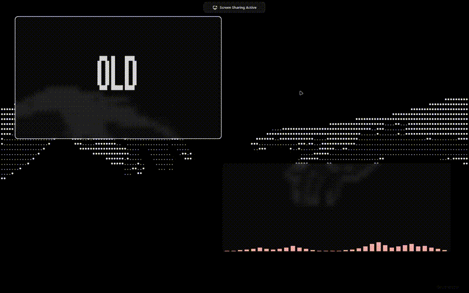

# ethereal lyrics

**Synced Spotify lyrics in your terminal with a beautiful aesthetic design.**

[](LICENSE)
[](https://www.python.org/)
[](https://linux.org/)

---

## Preview

<!-- REPLACE THIS WITH YOUR VIDEO -->
<!-- Option 1: GitHub native video (recommended) -->
https://github.com/user-attachments/assets/XXXXXXXX-XXXX-XXXX-XXXX-XXXXXXXXXXXX

<!-- Option 2: GIF fallback -->
<!--  -->

<!-- Option 3: YouTube link -->
<!-- [](https://youtu.be/YOUR_VIDEO_ID) -->

---

## Features

- **Real-time synced lyrics** - Words highlight as the song plays
- **Beautiful terminal UI** - Block character art with smooth animations
- **Smart synchronization** - Dynamic offset detection for perfect timing
- **Multi-provider support** - LRCLib (free), Musixmatch, Genius
- **Spotify integration** - Auto-detects currently playing track
- **No login required** - Works with local D-Bus detection

---

## Quick Install

### One-liner with curl

```bash
curl -fsSL https://raw.githubusercontent.com/samuz/ethereal-lyrics/main/install.sh | bash
```

### Or clone and install

```bash
git clone https://github.com/samuz/ethereal-lyrics.git
cd ethereal-lyrics
./install.sh
```

---

## Manual Installation

### 1. Clone the repository

```bash
git clone https://github.com/samuz/ethereal-lyrics.git
cd ethereal-lyrics
```

### 2. Create virtual environment

```bash
python3 -m venv venv
source venv/bin/activate
```

### 3. Install dependencies

```bash
pip install -e .
```

### 4. Configure Spotify (optional)

```bash
cp .env.example .env
# Edit .env with your Spotify credentials
```

### 5. Run

```bash
python -m src.main
```

---

## Usage

```bash
# Run the application
ethereal-lyrics

# Or run directly
python -m src.main
```

---

## Configuration

Create a `.env` file in the project root:

```env
# Spotify API (optional - for web playback detection)
SPOTIFY_CLIENT_ID=your_client_id
SPOTIFY_CLIENT_SECRET=your_client_secret
SPOTIFY_REDIRECT_URI=http://localhost:8888/callback

# Lyric sync offset (milliseconds)
# Positive = lyrics appear later
# Negative = lyrics appear earlier
LYRIC_OFFSET_MS=1000
```

### Getting Spotify API Credentials

1. Go to [Spotify Developer Dashboard](https://developer.spotify.com/dashboard)
2. Create a new app
3. Set redirect URI to `http://localhost:8888/callback`
4. Copy your Client ID and Client Secret

---

## How It Works

1. **Detection** - Detects Spotify playback via D-Bus (no login needed)
2. **Lyrics** - Fetches synced lyrics from LRCLib (free, no API key)
3. **Display** - Renders lyrics in real-time with beautiful animations
4. **Sync** - Dynamic offset detection adapts to each song

---

## Dependencies

- Python 3.10+
- Rich (terminal UI)
- httpx (HTTP client)
- Spotipy (Spotify API)

---

## Contributing

Contributions are welcome! Please feel free to submit a Pull Request.

1. Fork the repository
2. Create your feature branch (`git checkout -b feature/amazing-feature`)
3. Commit your changes (`git commit -m 'Add amazing feature'`)
4. Push to the branch (`git push origin feature/amazing-feature`)
5. Open a Pull Request

---

## License

This project is licensed under the MIT License - see the [LICENSE](LICENSE) file for details.

---

## Acknowledgments

- [LRCLib](https://lrclib.net/) - Free synced lyrics API
- [Rich](https://github.com/Textualize/rich) - Beautiful terminal formatting
- [Tokyo Night](https://github.com/enkia/tokyo-night-vscode-theme) - Color palette inspiration

---

<p align="center">
  
  <br>
  <sub>Built with passion for music lovers</sub>
</p>
